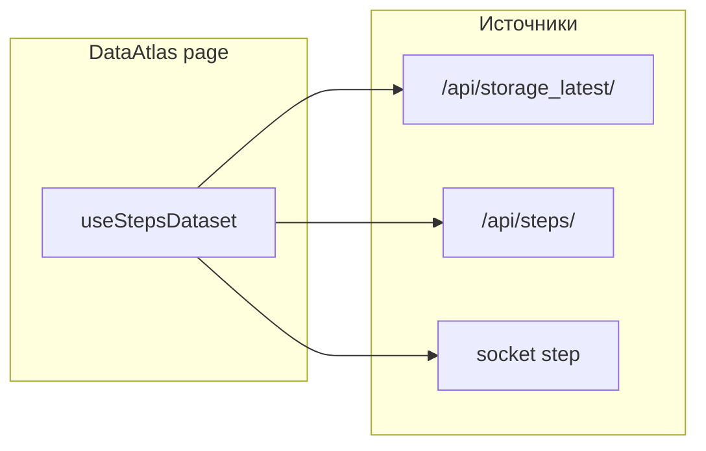

# План: Data Atlas (5 визуализаций)

## Контекст данных

- **Богатый снимок истории**: `GET /api/storage_latest/` проксирует storage `[get_latest](z:/Developer/jamming-bot/storage-service/app/api/db_manager.py)` — до ~3000 шагов с `timestamp`, `text_length`, `status_code`, `error`, `url`, `src`, `tags`, `words`, `hrases`, `entities`, семантическими полями.
- **Лёгкий список без storage**: `[/api/steps/](z:/Developer/jamming-bot/app-service/flask/app.py)` из Redis jobs — `step`, `status_code`, `url`, `src_url`, `text`, `semantic`, `words`, `hrases`, `sim` (без гарантированного `timestamp` в JSON).
- **Живое дополнение**: событие Socket.IO `[step](z:/Developer/jamming-bot/app-service/flask/app.py)` несёт форму бота, включая `timestamp`, `text`, `status_code`, `url`, `src` — удобно для кольцевого буфера последних N событий на клиенте.

## Решение по UI

- Одна маршрутная страница, например `**/atlas**`, с вертикальным скроллом: пять блоков (секций), общий тёмный/нейтральный фон в духе существующих `[tags.js](z:/Developer/jamming-bot/frontend/src/pages/tags.js)` / `[semantic.js](z:/Developer/jamming-bot/frontend/src/pages/semantic.js)`.
- Пункт в `[Navbar.js](z:/Developer/jamming-bot/frontend/src/Navbar.js)` и `Route` в `[App.js](z:/Developer/jamming-bot/frontend/src/App.js)`.
- Общий хук `**useStepsDataset**`: первичная загрузка `storage_latest` → нормализация строк в объекты; при ошибке или пустых `data` — fallback на `/api/steps/` с маппингом полей (`src_url` → `src`); подписка на `step` для append/обновления скользящего окна (например 500–2000 последних событий для «живых» виджетов).

## Нормализация полей (важно для текста/агрегатов)

- В storage значения приходят как строки; списки с бэкенда могли сохраниться как Python-представление списка. В плане заложить **один модуль `normalizeStep(row)`**: попытка `JSON.parse`, затем эвристика для `tags` / `words` / `semantic_words` / `hrases` (разделители), иначе одна строка как один токен.
- **Опционально (предпочтительно для качества)**: маленький эндпоинт в Flask, например `GET /api/atlas/steps`, который проксирует storage и **серверно** кладёт массивы как JSON-строки или отдельные поля-массивы — тогда d3-агрегации проще и стабильнее. Если не делать — только клиентский парсер.

---

## 1. Время и ритм

- **Вход**: `timestamp` (если есть), иначе порядок в выборке / `number`; `text_length`; опционально интервал до следующего шага.
- **Визуал**: горизонтальная **полоса времени** или **«сейсмограмма»** — по оси X время или индекс шага, по Y или толщине линии — `text_length` или константа с пульсацией; цвет — `status_code` или градиент по времени суток.
- **Реализация**: отдельный компонент на **d3** (`scaleTime` или `scaleLinear` по индексу), `svg`; при live-данных — либо пересчёт домена, либо фиксированное окно «последние T минут».

## 2. Текст и семантика

- **Вход**: нормализованные `words`, `tags`, `semantic_words`, `hrases`, при необходимости фрагмент `text`.
- **Визуал (v1 без ML)**: **2D force graph** слов/тегов: узлы — уникальные токены за окно последних K шагов или всей выборки с лимитом топ-N по частоте; рёбра — совместная встречаемость в одном шаге (вес = count). Альтернатива/дополнение: **бегущая лента** последних фраз из `hrases` или обрезанного `text` для «поэтического» слоя.
- **Реализация**: `d3-force` + `svg` (как идея в `[PageRank.js](z:/Developer/jamming-bot/frontend/src/components/PageRank.js)`, но проще); не дублировать тяжёлый 3D `[semantic.js](z:/Developer/jamming-bot/frontend/src/pages/semantic.js)`.

## 3. Граф и навигация

### Sankey (переходы между хостами)

- **Агрегация на клиенте** из нормализованных шагов: для каждой пары (`host(src)`, `host(url)`) суммировать `value` (число переходов). Исключить пустой `src` или маппить в `(direct)` / `(start)`.
- **Реализация**: добавить зависимость `**d3-sankey`** (в `d3@7` пакета sankey нет). Компонент `svg` + `d3-sankey` layout; подписи узлов — hostname, до ~40 узлов с группировкой «other» для хвоста.

### Sunburst (иерархия путей URL)

- **Иерархия**: корень → **hostname** → сегменты `pathname` (`split('/')`, декодирование). Листья — счётчик визитов или последний сегмент.
- **Реализация**: `d3.hierarchy` + `d3.partition` + arc generator; клик для `zoom` на поддерево (паттерн observable sunburst).

**Дендрограмма**: для v1 **не делать отдельно** — sunburst и dendrogram оба иерархические; если нужен именно дендрограммный вид, позже добавить `d3.cluster` на том же дереве без дублирования данных. В этой итерации достаточно **sunburst**.

## 4. Статусы и сбои

- **Вход**: `status_code`, поле `error` (непустое = сбой), опционально `status_string` при маппинге из Redis.
- **Визуал**: **пиксельная сетка** или вертикальные полосы: один шаг = один столбец/ячейка; цвет от кода ответа; мигание или контур при `error`; последние N из сокета — append справа.
- **Реализация**: `canvas` для производительности при большом N или `svg` с `rect` при N ≤ 500.

## 5. Агрегаты «одним взглядом»

- **Мини-панель из нескольких d3-графиков** в одной секции:
  - гистограмма `**text_length`** (bins);
  - bar chart **топ-тегов/слов** (из нормализованных полей);
  - распределение `**status_code`** (столбцы или pie — предпочтительно столбцы для читаемости).
- Обновление при приходе новых данных из хука (debounce пересчёта ~200–300 ms).

---

## Зависимости и тесты

- **npm**: `d3-sankey` (+ при необходимости типы `@types/d3-sankey` если используете TS позже; сейчас JS).
- **Тесты**: лёгкий unit-тест для `normalizeStep` и функции агрегации Sankey (чистые функции в `src/lib/atlas/`); при желании snapshot рендера секции с фикстурой из 5–10 шагов.

## Риски и меры

- **Пустой storage в dev**: fallback на `/api/steps/` и явный баннер «история ограничена».
- **Производительность**: для sunburst/Sankey ограничить топ-K рёбер/узлов; для force — cap узлов (например 80).
- **CORS**: если фронт ходит на тот же `Url`, что и сейчас, поведение как у существующих страниц.

