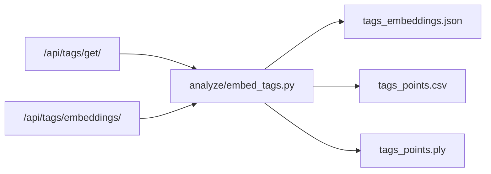

# План: Embed всех тэгов

## Цель

Сделать локальный аналитический pipeline для заметки [knowledge/jamming-bot/ideas/2026-03-31_Embed всех тэгов.md](Z:/Developer/jamming-bot/knowledge/jamming-bot/ideas/2026-03-31_Embed%20всех%20тэгов.md): выгрузить все теги, получить для них embeddings, собрать 3D-координаты и сохранить результат как артефакты анализа.

## Что уже можно переиспользовать

- [app-service/flask/app.py](Z:/Developer/jamming-bot/app-service/flask/app.py): уже есть `POST /api/tags/embeddings/` и `GET /api/tags/get/`.
- [app-service/flask/tag_embeddings.py](Z:/Developer/jamming-bot/app-service/flask/tag_embeddings.py): уже возвращает `vectors3d`, `links` и fallback-режим, если spaCy-модель недоступна.
- [tags-service/app/api/db_manager.py](Z:/Developer/jamming-bot/tags-service/app/api/db_manager.py): канонический агрегированный источник тегов с `name` и `count`.
- [analyze/bak/embedings.ipynb](Z:/Developer/jamming-bot/analyze/bak/embedings.ipynb): старый пример снижения размерности до 3D через PCA, если понадобится альтернативный режим.

## Рекомендуемый scope MVP

Сначала делать не пересчёт embeddings с нуля по всем шагам, а локальный экспорт уже агрегированных тегов:

- Источник тегов: `GET /api/tags/get/` или прямой tags-service grouped/all endpoint.
- Источник координат: `POST /api/tags/embeddings/`.
- Выход: `json/csv/ply` артефакты в `analyze/out/embed_tags/`.

Это даёт самый быстрый путь к рабочему результату и не дублирует текущую semantic-логику.

## План реализации

1. Добавить `analyze/embed_tags.py` как CLI-скрипт.
2. В скрипте получить весь набор тегов с именем и `count`.
3. Нормализовать список: убрать пустые значения, дедуплицировать, при необходимости ограничить `max_words` или батчевать запросы.
4. Отправить слова в `POST /api/tags/embeddings/` и использовать `vectors3d` как основной MVP-режим.
5. Сохранить промежуточные артефакты:

- `tags_raw.json`
- `tags_embeddings.json`
- `tags_points.csv`

1. Добавить экспорт `tags_points.ply`, где каждая вершина содержит `x y z`, а также полезные атрибуты вроде `count` и `label` там, где формат/совместимость позволяют.
2. Сохранить `metadata.json` с числом тегов, режимом embeddings (`vectors` или `sparse`), входным endpoint и путями к артефактам.
3. Если endpoint embeddings не подходит по масштабу или качеству, добавить второй режим `--projection pca`, использующий локальный spaCy-вектор + PCA по образцу из старого notebook.

## Предлагаемая схема

## Ключевые решения

- Базовый источник truth для MVP: агрегированные теги из tags-service, а не сырые `semantic_words` по всем steps.
- Базовый 3D-режим: уже существующие `vectors3d` из [app-service/flask/tag_embeddings.py](Z:/Developer/jamming-bot/app-service/flask/tag_embeddings.py), без нового ML pipeline.
- `PLY` нужен как формат обмена/рендера; его логично генерировать в `analyze/`, а не в web endpoint.

## Риски

- Текущий `build_embeddings_response()` ограничивает список `max_words`, значит для всех тегов может потребоваться батчевание или расширение API.
- `vectors3d` сейчас берутся из первых компонент spaCy-вектора, а не из отдельного алгоритма снижения размерности; для сцен это может оказаться достаточным, но не обязательно оптимальным.
- Стандартный ASCII `PLY` хорошо подходит для точек, но свойства вроде строкового `label` надо проверить на совместимость с целевым viewer/рендером.

## Проверка результата

- Скрипт запускается локально без изменения runtime-сервисов.
- На выходе есть валидные `JSON`, `CSV` и `PLY` файлы.
- Количество точек в `PLY` совпадает с количеством слов, для которых реально получены 3D-координаты.
- Результат можно открыть во внешнем 3D-инструменте или использовать как вход для следующих сцен/рендеров.

