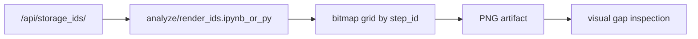

# План: рендер статусов пути в PNG

## Что уже есть

- В заметке [knowledge/jamming-bot/ideas/2026-03-31_Рендер статусов пути в PNG.md](knowledge/jamming-bot/ideas/2026-03-31_Рендер%20статусов%20пути%20в%20PNG.md) идея сформулирована как проход по `step_id` и отрисовка пикселей по координатам.
- В [knowledge/jamming-bot/web/jamming bot api.md](knowledge/jamming-bot/web/jamming%20bot%20api.md) уже описан нужный источник данных: `GET /api/storage_ids/` и прямой сервисный `GET /storage/get/ids`.
- В [knowledge/jamming-bot/dev/Jamming bot microservices.md](knowledge/jamming-bot/dev/Jamming%20bot%20microservices.md) видно, что в проекте уже есть `worker`, `worker2`, `worker3` и отдельный `backfill-worker`, то есть инфраструктура фоновых задач есть, но для этой идеи она нужна не на первом шаге.

## Рекомендация

Лучший путь сейчас: сделать это как аналитический pipeline в `analyze/` (notebook или небольшой CLI-скрипт), а не как новый постоянный воркер.

Почему это лучше:

- Задача похожа на batch-визуализацию, а не на online-processing.
- Входные данные уже можно получить одним запросом без сложной оркестрации.
- Проще быстро проверить гипотезу про полезность картинки, масштаб и плотность данных.
- Не придётся сразу решать хранение PNG, повторные прогоны, дедупликацию jobs и UI для запуска.

## Предлагаемая архитектура

## Как делать MVP

1. Получать отсортированный массив `step_id` через `GET /api/storage_ids/`.
2. Вычислять размер полотна из `max(step_id)`, а не хардкодить только `1920x1080/4`.
3. Рисовать бинарную карту присутствия: есть step -> светлый пиксель, нет step -> тёмный.
4. Сохранять PNG как артефакт анализа.
5. Отдельно добавить второй режим, если нужен именно “статус”, а не просто “наличие”: цвет кодирует `missing/present/enriched/error`.

## Важные решения до реализации

- Определить, нужен ли именно `presence map` или реально `status map`.
- Определить источник truth: только storage ids или агрегированный step state.
- Решить, нужен ли статический PNG, или потом потребуется зум/hover/UI.

## Что я считаю лучшим вариантом

### Вариант A. Notebook/скрипт в `analyze/`

Рекомендую как первый шаг.

Плюсы:

- самый дешёвый по времени
- быстро проверить идею
- легко менять палитру, размер и алгоритм

Минусы:

- запуск вручную
- нет встроенного UI и очереди

### Вариант B. RQ job внутри существующих worker

Имеет смысл только если картинку нужно регулярно пересобирать и показывать в UI.

Плюсы:

- можно запускать по кнопке или расписанию
- вписывается в текущую очередь jobs

Минусы:

- выше сложность
- нужен lifecycle артефактов и endpoint на выдачу PNG

### Вариант C. Отдельный сервис рендера

Сейчас не рекомендую.

Плюсы:

- чистое разделение ответственности

Минусы:

- избыточно для текущего масштаба идеи
- добавляет deployment и поддержку без явной выгоды

## Риски

- Если `step_id` очень разрежены, картинка будет огромной и малополезной.
- Если ids не плотные и имеют большие скачки, нужна нормализация по диапазонам или tiled rendering.
- Если нужен именно статус пайплайна, одного списка ids недостаточно: придётся запрашивать более богатое состояние.

## Практический next step

- Сделать MVP в `analyze/render_ids.ipynb` или `analyze/render_ids.py`.
- На входе брать `/api/storage_ids/`.
- На выходе получить 2 PNG:
  - `presence_raw.png` с прямым отображением `step_id -> pixel`
  - `presence_downsampled.png` если исходное полотно слишком большое
- После этого уже решать, выносить ли задачу в RQ job и UI.

## Дополнительное наблюдение

- Сейчас заметка по пути [knowledge/jamming-bot/ideas/2026-03-31_Рендер статусов пути в PNG.md](knowledge/jamming-bot/ideas/2026-03-31_Рендер%20статусов%20пути%20в%20PNG.md) по содержанию выглядит как заметка про “наличие шагов”, а не про “статусы”. Это важно уточнить до реализации, потому что от этого зависит и источник данных, и схема цветов.

